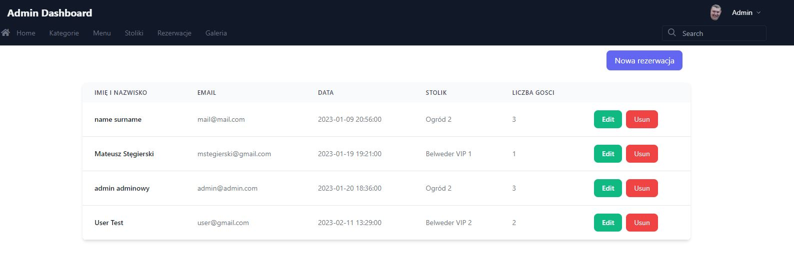
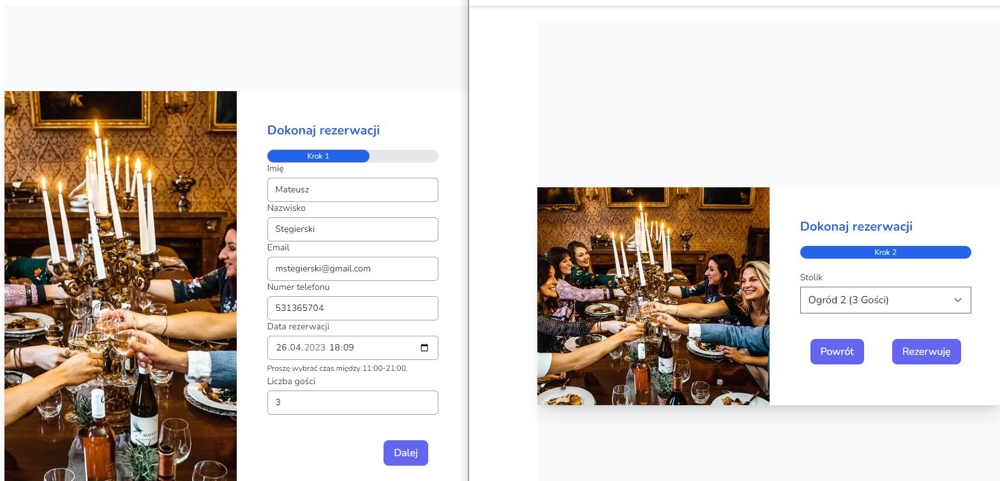
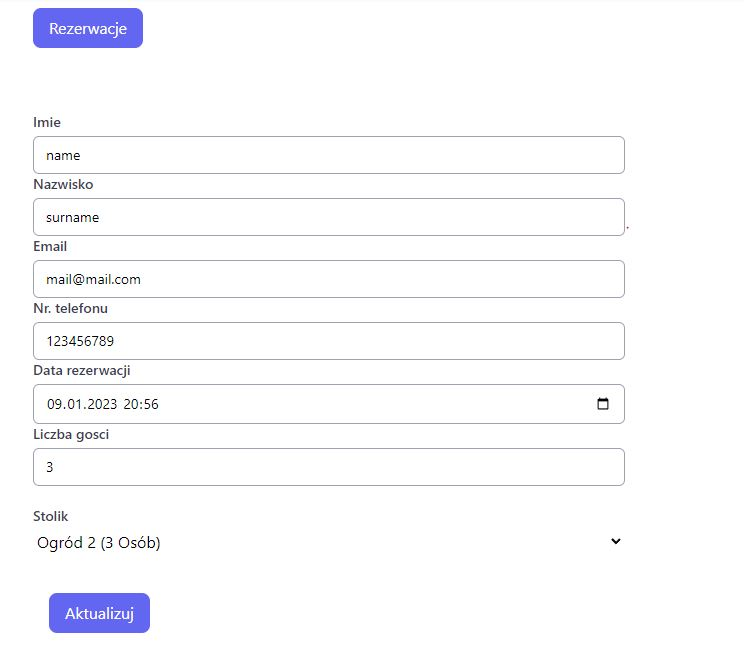

# psznygryl

Psznygryl is Laravel project  to manage table reservations. This project uses the following tools:

- [Laravel 9.x](https://github.com/laravel/laravel)
- [Laravel Breeze](https://github.com/laravel/breeze)

## Usage

Extract code into MySQL working directory and use the following command in main directory of the project

```bash
php artisan breeze
```

## Examples of system operation


||
|:--:|
| *Admin Dashboard* |

||
|:--:|
| *Making a reservation* |

||
|:--:|
| *Editing a reservation in admin dashboard* |

